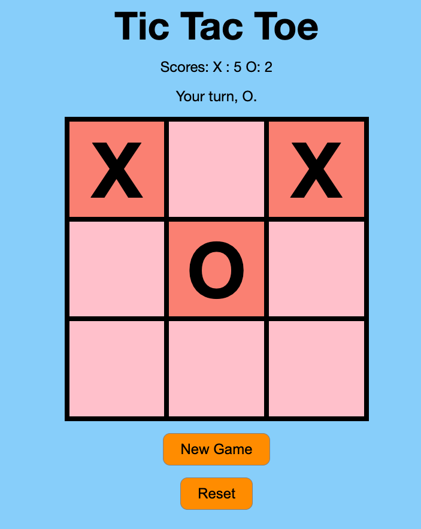

# CS110_Lab_3
Tic Tac Toe Game
Description

Most of us have probably played a game of Tic Tac Toe. For today's lab you will implement a Tic Tac Toe game using HTML, CSS, and JavaScript. We know that there are many projects on github that implement just such a game, but be sure to write your own code as copying will result in a zero. 

You may work in a team of 2 or individually on this lab assignment. Only one submission is required per team. You will have to add your partner's name when you upload the folder to Gradescope. If you don't currently have a partner, that's fine. We can assign you a partner during lab if you wish. 

I suggest you tackle the assignment in parts, meaning start with a simple prototype and continually refactor your solution to add additional features and improve the code design. 

Sample Design

You can use the sample HTML Download HTMLand CSS Download CSSfiles. You have to implement the main.js and add the extra features outlined.  

Basic Requirements

Allow for two players to take turns. Assume X always starts the game. 
Detect when the game ends (when there is no more possible moves, i.e. all squares have either an X or an O). 
Detect when a player wins. To win, the player must get three of their pieces (X or O) in a row.
Output message to indicate whether its player X's turn or player O's turn. 
Maintain the score for each player, i.e. the number of games that player has won. There should be a "Reset" button that resets the scores as well as the board. 
Maintain an array that holds the squares that contain Xs and one that holds the moves made by O. You can use this array to determine if 9 moves have been made and whether its a tie, or whether the current player who made the move just won the game. 
Create a New Game button that resets the board and starts a new game. 
Your design should look similar to the above prototype but you can be create in your design as long the required elements are included. 
Once you implemented the above features, then move on to create a simple AI to allow the user to play against the computer. Note, the computer can be pretty dumb and just select to play any random square on the tic tac toe board. If you are interested in making your AI "smarter", then look at the MinMax approach (https://www.geeksforgeeks.org/minimax-algorithm-in-game-theory-set-3-tic-tac-toe-ai-finding-optimal-move/Links to an external site.). If you implement the MinMax approach, you can get upto 7 points extra credit. You must make a note during submission (in the README) to indicate if you implemented the MinMax approach. 

 

You may add additional features to this game but it should meet the minimum specs outlined above. 
